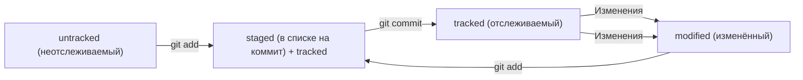

# Шпаргалка git

`Git` — это распределённая система контроля версий, которая позволяет отслеживать изменения в коде, работать в команде и хранить историю проекта.

## Комманды и работа с `git`1
### 1. Инициализация проекта
```Shell
# Создать новый локальный репозиторий
git init
# Проверить состояние репозитория
git status
# Добавить файл в отслеживание
git add <имя_файла>
# Добавить все файлы
git add .
# Создать коммит
git commit -m "Первый коммит"
```
----
### 2. Настройка Git
```Shell
# Настройка имени и почты
git config --global user.name "Ваше имя"
git config --global user.email "you@example.com"
```
----
### 3. Просмотреть историю коммитов — `git log`
----
### 4. Привязать удалённый репозиторий к локальному — `git remote add`
----
### 5. Убедиться, что репозитории связаны, — `git remote -v`
----
### 6. Типовой сценарий работы
1. Создать локальный репозиторий `(git init)`.
2. Добавить файлы `(git add .)`.
3. Сделать первый коммит `(git commit -m "Init project")`.
4. Подключить удалённый репозиторий `(git remote add origin ...)`.
5. Отправить изменения `(git push -u origin main)`.
----
## Хеш — идентификатор коммита
 **Хеширование** (от англ. _hash_, «рубить», «крошить», «мешанина») — это способ преобразовать набор данных и получить их «отпечаток» (англ. _fingerprint_).
Информация о коммите — это набор данных: когда был сделан коммит, содержимое файлов в репозитории на момент коммита и ссылка на предыдущий, или **родительский** (англ. _parent_), коммит.

Git хеширует (преобразует) информацию о коммите с помощью алгоритма **SHA-1** (от англ. _**S**ecure **H**ash **A**lgorithm_ — «безопасный алгоритм хеширования») и получает для каждого коммита свой уникальный **хеш** — результат хеширования.
Git хранит таблицу соответствий `хеш → информация о коммите`. Если вы знаете хеш, вы можете узнать всё остальное: автора и дату коммита и содержимое закоммиченных файлов. 
----
## Исследуем лог

Элементы, из которых состоит описание:

- строка из цифр и латинских букв после слова **commit** — это хеш коммита;
- **Author** — имя автора и его электронная почта;
- **Date** — дата и время создания коммита;
- в конце находится сообщение коммита.

Важное:

- Можно вызвать не только полный лог, но и сокращённый — это делается командой `git log --oneline`.
- В сокращённом логе выводятся сокращённые хеши — их можно использовать точно так же, как и полные.

----
## HEAD — всему голова
 
 Файл `HEAD` (англ. «голова», «головной») — один из служебных файлов папки `.git`. Он указывает на коммит, который сделан последним (то есть на самый новый).
 В этом можно убедиться с помощью терминала. Перейдите в папку `.git` командой `cd`. Посмотрите содержимое файла `HEAD` командой `cat`.

```Shell
$ pwd # посмотрели, где мы
/Users/user/dev/first-project

$ cd .git/
$ ls # посмотрели, какие есть файлы
COMMIT_EDITMSG  ORIG_HEAD  description  index  logs/     refs/
HEAD            config     hooks/       info/  objects/

$ cat HEAD # команда cat показывает содержимое файла
ref: refs/heads/master # в файле вот такая ссылка 
```
----
## Статусы файлов в Git



Одна из ключевых задач Git — отслеживать изменения файлов в репозитории. Для этого каждый файл помечается каким-либо статусом. Рассмотрим основные.

- **`untracked`** (англ. «неотслеживаемый»)  
    Мы говорили, что новые файлы в Git-репозитории помечаются как `untracked`, то есть неотслеживаемые. Git «видит», что такой файл существует, но не следит за изменениями в нём. У `untracked`-файла нет предыдущих версий, зафиксированных в коммитах или через команду `git add`.
- **`staged`** (англ. «подготовленный»)
    После выполнения команды `git add` файл попадает в **staging area** (от англ. _stage_ — «сцена», «этап [процесса]» и _area_ — «область»), то есть в список файлов, которые войдут в коммит. В этот момент файл находится в состоянии `staged`.
    В одном из предыдущих уроков мы сравнили коммит с фотографией. Можно развить эту аналогию и сказать, что команда `git add` добавляет персонажей (текущее содержимое файла или нескольких файлов) на **сцену** (англ. _stage_) для общей фотографии, а `git commit` делает снимок всей сцены целиком.
- **`tracked`** (англ. «отслеживаемый»)  
    Состояние `tracked` — это противоположность `untracked`. Оно довольно широкое по смыслу: в него попадают файлы, которые уже были зафиксированы с помощью `git commit`, а также файлы, которые были добавлены в staging area командой `git add`. То есть все файлы, в которых Git так или иначе отслеживает изменения.
- **`modified`** (англ. «изменённый»)  
    Состояние `modified` означает, что Git сравнил содержимое файла с последней сохранённой версией и нашёл отличия. Например, файл был закоммичен и после этого изменён.
----
## Оформление сообщений к коммитам
### Conventional Commits
Стандарт **Conventional Commits** (англ. «соглашение о коммитах») отличается качественной документацией и подробной проработкой. Он подходит для репозиториев с исходным кодом программ.
Conventional Commits предлагает такой формат коммита: `<type>: <сообщение>`. Первая часть `type` — это тип изменений. Таких типов достаточно много. Вот два примера:

- `feat` (сокращение от англ. _feature_) — для новой функциональности;
- `fix` (от англ. «исправить», «устранить») — для исправленных ошибок.

Более подробный список можно увидеть [на сайте с описанием этого стиля](https://www.conventionalcommits.org/ru/v1.0.0-beta.4/#%D1%81%D0%BF%D0%B5%D1%86%D0%B8%D1%84%D0%B8%D0%BA%D0%B0%D1%86%D0%B8%D1%8F).
### GitHub-стиль

GitHub можно использовать не только для хранения файлов проекта, но и для ведения списка **задач** (англ. _issue_) этого проекта. Если коммит «закрывает» или «решает» какую-то задачу, то в его сообщении удобно указывать ссылку на неё. Для этого в любом месте сообщения нужно указать `#<номер задачи>`. Например, вот так.

```Shell
$ git commit -m "Исправить #334, добавить график температуры" 
```
